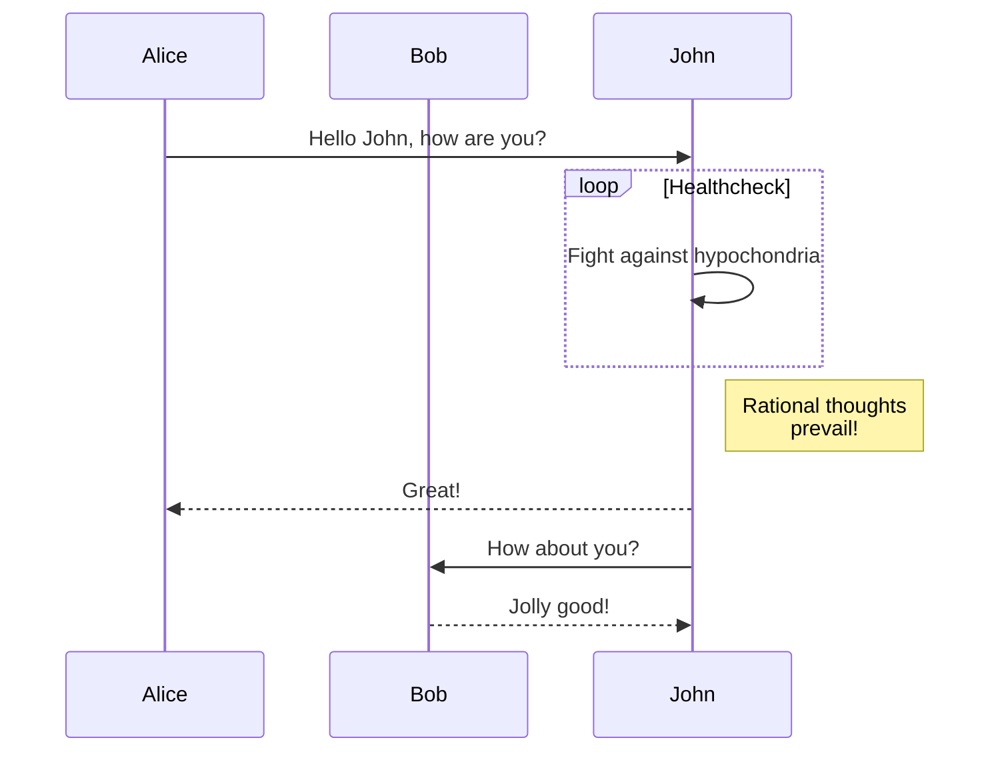

# TEMPLATE - Project or Initiative Brief

> ***Wait, whatʼs this?***
>
> A Project or initiative brief is the second step an idea takes toward becoming a product.
>
> A product owner in partnership with a tech lead or engineer will create a brief and fill out with just enough research and direction to communicate the strategic direction and importance of a new initiative to team members and stakeholders.
>
> As a reminder, the first is for a product owner or engineer to find a partner in the other to agree on problem, scope, and desired outcomes. So as the brief, this is just a view into the product and technical planning, any relevant data, user stories, architectural designs are superseded by subsequent JIRA Epics, Spikes, and Stories. You may if you like create sub documents under this document as a place to keep all that more detailed research, user interviews, meeting notes, technical reviews, etc.
>
> ==**Note**: sections marked with an asterisk are required.==

---

## RACI Overview

> A RACI chart helps assign ownership of and accountability of a project or initiative. Especially where the proposer is not on the PDE team that will be doing the work. For each area you should list the person who is responsible or accountable, often the same person, though in may cases may not be. Here's a [RACI Primer](https://en.wikipedia.org/wiki/Responsibility_assignment_matrix) if this structure of involvement and ownership is new to you.

| Area                   | Responsible | Accouable | Consulted | Informed |
| ---------------------- | ----------- | --------- | --------- | -------- |
| **Product**            |             |           |           |          |
| **Scoping**            |             |           |           |          |
| **Technical Planning** |             |           |           |          |
| **Brief Review**       |             |           |           |          |

---

## Problem Statement*

> What problem and for whom is this work going to solve? Or what new thing will this work enable?
>
> This is section is to help bring in to focus the "Why?" What is the problem and why is this feature or solution important? Who does it help and how does it help them?
> Keep this section focused as it's context for the rest of the document, and should focus the reader to the solution and level of effort of it.
>
> If this section is posing an issue, I suggest writing a short user narrative that illustrates the user's challenge and the value addressing the challenge provides. Don't worry about the how, design, user flow, etc, as that is not the goal of this brief write-up.

---

## Open Questions

> These are questions to be answered that are sources of new scope or uncertainty

### examples

- What is does it mean to be done with this feature?
- How are we measuring success?
- Are there guardrail KPIs?

---

## Scope*

> How is the problem listed above being solved, what are the key features or behaviors being addressed? This section is effectively the functional scope. 
>
> If there is a BRD please include a highlevel summary here, and link to the BRD or similar.

---

## Objective Key Results

> **OKRs -** (How are we measuring this projectʼs or initiativeʼs success?)

| **Objective** | **Key Result**|
| :---: | :--- |
| **example**<br/>Increase Readership |<li> Increase overall page views by 2X measured by daily page views <li> double the number of existing content articles <li> ensure 100% of all content articles is indexable by google's web spider. |

---

## User Stories

> Where the scope is the problem being solved, and the OKRs are how is success being measured. This section is the "How". How is the user's experience changing on the application to meet the need described above, and what outcomes are there for the user to meet that need. [More information](https://www.iiba.org/knowledgehub/agile-extension/7-techniques/7-21-user-stories/) about how to write a user story. 
>
> I prefer the structure of "In order to... As a... I need to..." over "As a... I want to... So that...", as I like to put the value statement first, then who, followed by what the action is. As that puts the value front and center. Though either approach works.
> A relevant article on the subject: [As a… I want… so that… considered harmful](https://blog.crisp.se/2014/09/25/david-evans/as-a-i-want-so-that-considered-harmful)

|  In order to...           |  As a...   | I need to...               |
| ------------------------- | ---------- |--------------------------- |
| **example** have something delivered by USPS to me | consumer | provide a seller my delivery information |
|&nbsp;| | |
|&nbsp;| | |

---

## Non-functional Requirements

> This section to include all requirements that are not functional in nature  
[Non-functional requirement definition](https://en.wikipedia.org/wiki/Non-functional_requirement)

---

## Assumptions

> This should only contain assumptions that are driving the architectural/technical design choices. (Functional as well as Technical)

---

## High Level Technical Solution (Boxes and Arrows level) *

> This is where the bulk of technical portions of the brief is likely to live. Please review this documentation model for thoughts on how to fill out this section. If you are familiar with 4+1, you may want to review this document for ideas on what to explore or research. Once green-lit additional definition will need to be documented as a part of detailed discovery and planning.
>
> - [Design docs at Google](https://www.industrialempathy.com/posts/design-docs-at-google/)
> - [Reference Google Doc Template](https://docs.google.com/document/d/1nEdWJvfj_JrssyVHhWYM2Tt39oZwRbZ-1Z3LzOcp43c/edit?usp=sharing)

---

## New Tools or Design Patterns

> Are we building new things or need to use new things, include here — especially if it impacts budget or requires legal review

---

## Work Breakdown and Milestones *

> This is a break down of the work into large chunks that can provide user value, it's meant to break up the work in a way that can be demonstrated on a sprint by sprint basis to track progress, for larger initiatives this could be a milestone plan with LOE sizing and number of folks involved. The example below is for a larger initiative and you can see how this could be for smaller segments of work with less associated unknowns or risk.

| Sprint | Description & Value | Sizing/LOE/Risk |
|:---:|---|:---:|
|**example**<br>M1 |<li>Consumer is able to login, see product listings.<li>Product listings are hand loaded into a database. | L
|**example**<br>M2|<li>Sellers are able to log into their account.<li>Sellers are able to load their products in via a client console.| M |
|&nbsp;|||
|&nbsp;|||

---

## Data / Content Migrations (if any)

> Are there any one-time or periodic data or content migrations required that are not part of the scope of the operational system?

---

## Go to Market / Commercialization (if any)

> What is the plan to go from something in a software environment and into our customer’s hands?

---

## QA Plan

> How are we testing this solution?

---

## Diagrams

> Include light weight diagrams here to help reduce any confusion or key decisions that help illustrate or support the milestone plan above.



```goat

"START";

do {
  if ("FIND A MENU ITEM OR BUTTON WHICH LOOKS RELATED TO WHAT YOU WANT TO DO.") {
    "CLICK IT.";
  } else {
    if ("PICK ON AT RANDOM.") {
      "CLICK IT.";
    } else {
      "GOOGLE THE NAME OF THE PROGRAM PLUS A FEW WORDS RELATED TO WHAT YOU WANT TO DO. FOLLOW ANY INSTRUCTIONS.";
    }
  }

  if ("DID IT WORK?")
    return "YOU'RE DONE!"

} while("HAVE YOU BEEN TRYING THIS FOR LESS THAN AN HOUR?")

"ASK SOMEONE FOR HELP OR GIVE UP."
```

---

## Additional Assets/Resources

> Other documents of importance — remove / add as there is additional supporting documentation

| Title/Docs | Description | Link |
| --- | --- | --- |
| JIRA Epic/Tickets | The backlog and user stories | [jira dashboard link](?) |
| Product Brief | if there is a separate product brief | [link to BRD](?) |
| Analytics Plan | | |
| ELT / ETL transformations | if there is data translation or similar... | [link to folder of ETL transform specs](?) |
